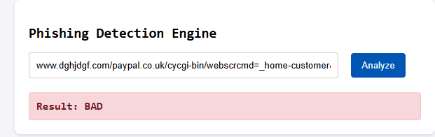

# Phishing URL Detector 🎣

A machine learning web application designed to detect and classify malicious phishing URLs. This project features a custom Natural Language Processing (NLP) pipeline and a Logistic Regression classification model, served through a Flask REST API with a clean front-end interface.

## 🧠 Technical Architecture

### 1. Machine Learning & NLP
* **Algorithm**: Logistic Regression (Binary Classification: 'Good' vs 'Bad').
* **Dataset**: Trained on a dataset of 549,346 labeled URLs.
* **Feature Extraction**: 
  * Tokenized using NLTK `RegexpTokenizer`.
  * Noise reduction via English stop-word removal.
  * Root word extraction using NLTK `PorterStemmer`.
  * Vectorized into numerical arrays using strictly defined `CountVectorizer` rules.

### 2. Web Stack
* **Backend**: Python / Flask. Exposes a `/predict` POST endpoint that receives URLs, runs them through the exact training preprocessing pipeline, and returns the model's prediction.
* **Frontend**: Vanilla HTML, CSS, and JavaScript. Uses the asynchronous `fetch()` API to communicate with the Flask backend in real-time without page reloads.

---

## 📸 App Demonstration

Here is a visual demonstration of the Phishing Detection Engine in action. In this example, a suspicious URL impersonating PayPal on an unusual domain is correctly identified as 'BAD'.



---

## 📈 Model Performance & Evaluation

The core of this application is the Logistic Regression classifier. This algorithm was selected due to its excellent performance on large, sparse datasets (such as those generated by word-count vectorizers), its relatively short training time, and its high level of interpretability.

The model was evaluated on a test set of 109,870 URLs, achieving an **overall accuracy of 96%**. 

In a cybersecurity context, minimizing false positives (flagging a safe site as malicious) and false negatives (letting a phishing site through) is critical. Here is the performance breakdown specifically for identifying **"bad" (phishing)** URLs:

| Metric | Score | Description |
| :--- | :--- | :--- |
| **Precision** | **97%** | When the model flags a URL as phishing, it is correct 97% of the time, resulting in very few false alarms for users. |
| **Recall** | **90%** | The model successfully detects 90% of all actual phishing URLs in the wild. |
| **F1-Score** | **93%** | The harmonic mean of Precision and Recall, showing a highly balanced and robust model. |

**Full Classification Report:**
```text
              precision    recall  f1-score   support

         bad       0.97      0.90      0.93     31152
        good       0.96      0.99      0.97     78718

    accuracy                           0.96    109870
   macro avg       0.96      0.94      0.95    109870
weighted avg       0.96      0.96      0.96    109870
